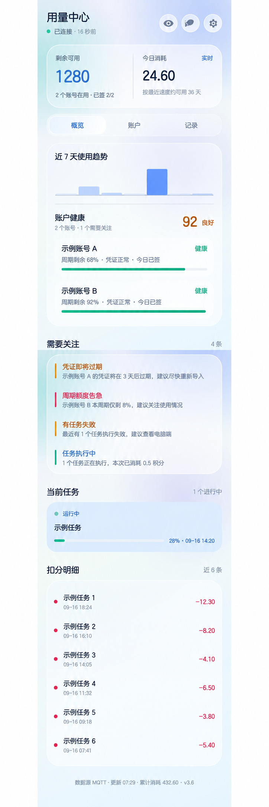

# WorkBuddy Multi-Account Monitor

一个隐私优先、完全本地运行的 WorkBuddy 多账号工具，包含电脑端管理面板、Android App、桌面小组件、自动签到和用量统计。

> 非官方社区项目，与腾讯或 WorkBuddy 官方无隶属关系。请在遵守服务条款和当地法律的前提下使用。



上图为 AI 生成的视觉演示图，使用虚构数据，并非实际 App 截图；实际界面以安装后的版本为准。

## 能做什么

- 动态管理任意数量的 CN / Global 账号，不写死账号名称或数量。
- 汇总余额、套餐周期、今日消耗、本月消耗和任务流水。
- 对 CN 账号执行幂等每日签到，已签到会安全跳过。
- Windows 09:00、21:00 与登录后补签。
- Android App 提供概览、账号、记录、健康度和风险提醒。
- Android 桌面小组件显示余额、签到和任务状态。
- 局域网 HTTP 优先，外网可选 MQTT 会合点。
- 登录令牌只保存在本机，不写入 APK。

## 设计原则

- **本地优先**：凭证池、用量历史与会话数据全部留在用户电脑。
- **安全默认值**：首次配置只启用带随机令牌保护的局域网；公共 MQTT 必须由用户明确开启。
- **数据驱动**：App 从 Snapshot 动态渲染当前和未来账号。
- **不伪造成功**：过期数据会明确标记，编译通过不等于真机验收完成。

## 系统结构

```text
WorkBuddy 本机登录状态 / 本地数据库
                 │
                 ▼
      Node.js 多账号面板与签到工具
                 │
                 ▼
         Python 伴侣服务 :8791
             │          │
             │          └── MQTT（可选外网会合点）
             ▼
       Android App / Widget
```

## 五分钟开始使用

### 1. 准备环境

基础功能需要：

- Windows 10/11、macOS 或 Linux
- Node.js 18+
- Python 3.10+
- 已安装并登录 WorkBuddy

当前 APK 构建脚本仅支持 Windows，还需要：

- JDK 17（设置 `JAVA_HOME`）
- Android SDK Platform 34
- Android Build Tools 34 或更高版本
- 设置 `ANDROID_SDK_ROOT` 或 `ANDROID_HOME`

### 2. 克隆并初始化

```bash
git clone https://github.com/interli3/workbuddy-multi-account-monitor.git
cd workbuddy-multi-account-monitor
python scripts/configure.py
```

初始化脚本会自动探测局域网地址、生成独立的伴侣服务令牌，并创建不会提交到 Git 的本地配置。若识别了错误网卡，可执行：

```bash
python scripts/configure.py --lan-ip 192.168.1.100
```

默认不会向公共 MQTT broker 发送任何数据。如果确实需要手机离开局域网后继续查看，可主动开启，并自动生成独立随机主题：

```bash
python scripts/configure.py --enable-public-mqtt
```

重复运行配置脚本会保留已有的 MQTT 主题和伴侣服务令牌。若要重新关闭 MQTT：

```bash
python scripts/configure.py --disable-mqtt
```

### 3. 导入账号

```bash
npm start
```

浏览器打开 [http://127.0.0.1:8765](http://127.0.0.1:8765)，点击“导入本机账号”。添加多个账号时，在 WorkBuddy 中切换并登录目标账号，再次导入即可；账号按 UID 合并。

### 4. 启动伴侣服务

```bash
python scripts/run_bridge.py
```

验证地址：

- [http://127.0.0.1:8791/health](http://127.0.0.1:8791/health)
- [http://127.0.0.1:8791/snapshot](http://127.0.0.1:8791/snapshot)
- [http://127.0.0.1:8791/status](http://127.0.0.1:8791/status)

### 5. 构建 Android App

```powershell
python mobile/build_apk.py --clean
```

输出为 `mobile/out/wbmon.apk`。首次构建会在本机生成独立签名密钥和随机密码；请自行备份，丢失后无法覆盖升级原 APK。自己配置后构建的 APK 已内置本机局域网地址和伴侣服务令牌，但不会包含 WorkBuddy 登录令牌。

如果使用 GitHub Release 中不绑定任何电脑的通用 APK，请先在电脑运行 `python scripts/configure.py`，再把 App 设置中的“局域网地址”和“伴侣服务令牌”分别填写为 `config.local.json` 的 `lanUrl` 与 `bridgeToken`。

### 6. 安装 Windows 自动签到

```powershell
powershell -ExecutionPolicy Bypass -File scripts/install_windows_checkin_task.ps1
```

计划任务在每天 09:00、21:00 和用户登录 Windows 后运行；失败每 15 分钟重试，最多三次，并避免重叠执行。

## 常用命令

```bash
node src/cli.js import-local     # 导入当前 WorkBuddy 登录账号
node src/cli.js list             # 查看账号列表，不显示 token
node src/cli.js refresh-all      # 刷新额度并记录用量
node src/cli.js checkin-all      # 给所有可签到账号签到
python mobile/audit.py           # Android 静态审计
python mobile/test_daymark.py    # 今日消耗回归测试
python mobile/test_usedtoday_fix.py
python mobile/test_bridge_auth.py
```

## 数据口径

- WorkBuddy 的 `working` 状态映射为“运行中”。
- `session_usage.used` 是 Token 数，不能直接当作积分。
- `credit_json` 是会话累计积分快照，今日消耗使用本地午夜前后的累计值求差。
- 签到奖励和赠送积分不会被误算为消费。
- 套餐余额不动但周期已用增加时，周期口径用于避免漏报。

## 目录结构

```text
src/                    Node.js 面板、账号池、签到和用量逻辑
public/                 本机管理面板与浏览器小组件
mobile/java/            原生 Android Java 源码
mobile/res/             Android 布局与视觉资源
mobile/bridge_multi.py  Python 多账号伴侣服务
mobile/build_apk.py     零 Gradle APK 构建脚本
scripts/configure.py    本地隐私配置生成器
scripts/run_bridge.py   伴侣服务入口
scripts/*.ps1           Windows 自动签到脚本
docs/                   已脱敏公开素材
```

## 安全与隐私

绝对不要提交 `credentials.json`、WorkBuddy `*.info` 文件、JWT、数据库、日志、会话导出、Android 签名密钥或 `config.local.json`。

非本机访问 `/snapshot`、`/status` 和 `/access` 时，伴侣服务会校验随机 Bearer 令牌；`/health` 与 APK 下载保持公开。公共 MQTT 默认关闭。主动启用后使用的是匿名 broker；随机主题降低碰撞和猜测概率，但不等于加密。敏感环境建议保持局域网模式，或换成自己控制的认证 MQTT broker。详见 [SECURITY.md](SECURITY.md)。

## 登录授权说明

WorkBuddy 官方访问令牌不是永久凭证。本项目不会绕过官方认证，也不会把 token 嵌入 APK。官方撤销会话、修改密码或授权真正失效时，需要在 WorkBuddy 中重新登录对应账号并再次导入。

## 发布前测试

CI 模板保存在 `docs/ci-workflow.yml`。将它放到 `.github/workflows/ci.yml` 后可启用 GitHub Actions；当前发布账号授权不含 workflow 权限，因此本次仅完成本地测试，未运行远端 CI。

```bash
npm run audit
npm test
python scripts/configure.py --no-auto-lan --no-bridge-auth --disable-mqtt
python mobile/build_apk.py --clean
```

上面的三个配置开关只用于制作不含维护者地址、令牌或 MQTT 主题的公开通用 APK。项目包含布局资源、Widget RemoteViews 白名单、今日消耗、跨日重置和局域网鉴权测试。需要验证可选公共 MQTT 时，另行运行 `node mobile/_mqtt_probe.js`。真实手机安装、触控和桌面组件仍应在目标设备上最终验收。

## 贡献

欢迎提交 Issue 和 Pull Request。截图、日志和测试数据必须先脱敏。详见 [CONTRIBUTING.md](CONTRIBUTING.md)。

## License

[MIT](LICENSE)
